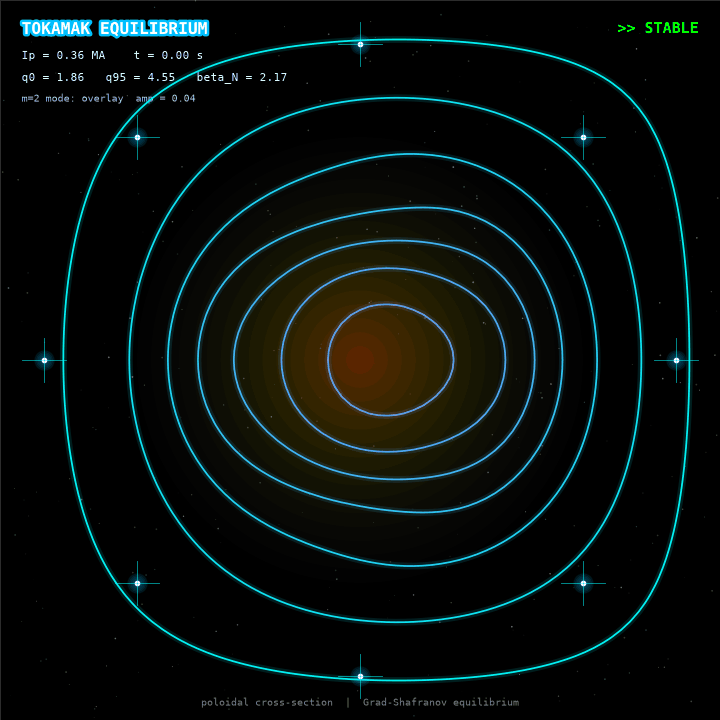

# Tokamak

A little visualization of a tokamak plasma going from calm to falling apart, built by solving the Grad-Shafranov equation and watching what happens as the current ramps up.

**Author's note:** I'm not a physicist. This is just my and Claude's best shot at something that looks cool and is grounded in real physics where we could manage it. If you *are* a physicist and something here makes you wince, I'd genuinely love to hear about it (and I'm sure there's something).

## What you're looking at

The GIF is a poloidal cross-section of a tokamak: a slice through the doughnut. The glowing rings are contours of the poloidal magnetic flux ψ, i.e. the shape of the magnetic field that confines the plasma. Over the run, the plasma current ramps up, and the stability metrics drift toward two real limits:

- **q95 < 2**: the external kink limit
- **beta_N > 3**: the Troyon pressure limit

The story of the run: calm, then marginal, then a pressure-limit disruption at the end.

## What's actually real

- **The equilibrium.** Each frame solves the Grad-Shafranov equation, `Δ*ψ = -μ0 R J_φ`, on a 2D (R, Z) grid with finite differences and ψ = 0 on the walls. The sparse matrix is factorized once and reused every frame.
- **The safety factor.** q(r) is computed from the enclosed current using the large-aspect-ratio formula, and q0 and q95 come from it.
- **Troyon beta.** beta_N is computed with units done properly (beta in %, a in m, B0 in T, Ip in MA).
- **Current diffusion.** The current profile diffuses resistively over time (a cylindrical diffusion equation, substepped to stay numerically stable).
- **The sawtooth logic.** If q0 drops below 1, a Kadomtsev-style relaxation flattens the current inside the q=1 surface while conserving enclosed current. In the current run q0 hovers right around 1.0 and never actually crosses it, so this code is in the repo but doesn't fire.

## What's not real because I'm not a physiscist (please read this part)

- **The current profile is prescribed**, not solved self-consistently from p'(ψ) and FF'(ψ). A real equilibrium code would do that.
- **The plasma cross-section is circular**, not D-shaped.
- **The wobbling, rotating ripple is a visual overlay.** It is a hand-built m=2 helical perturbation added to ψ, with an amplitude that grows as q95 falls toward 2 and beta_N rises toward 3. It is not a self-consistent MHD instability calculation. It's there to show *roughly* what a tearing/kink-type mode looks like in cross-section and because the field looks dead without it. The HUD in the GIF says "overlay" for this reason.
- **The "disruption" at the end** is triggered by the beta_N threshold and dramatized with a red wall flash, sparks, and a fading core. Real disruptions are far more complicated.
- **The ramp rates and profile parameters were tuned by hand** so the run walks through an interesting arc. They're not fit to a real machine.
- **Coils and starfield** are decoration.

## Run it

```bash
python -m venv .venv
.venv\Scripts\activate          # Windows
pip install numpy scipy matplotlib imageio
python render_gif.py
```

This regenerates `tokamak_field.gif`. Rendering takes a minute or so.

## Files

- `tokamak_physics.py`: Grad-Shafranov solver, q-profile, beta_N, stability criteria
- `tokamak_sim.py`: time evolution (current diffusion, ramp, events)
- `render_gif.py`: renders the GIF, including the mode overlay and HUD

## A note on how this got made

This started as an attempt to train a reinforcement-learning agent to stabilize the vertical instability in a tokamak. That plant turned out to be wrongly specified on my (well, Claude's) first few tries, and it took a couple of rounds of debugging to even get a controllable one. We then pivoted to this equilibrium visualization instead. The RL code isn't in this repo.

## Honest disclaimer

Please don't use any of this for anything that matters. It's a visualization project made for fun.
